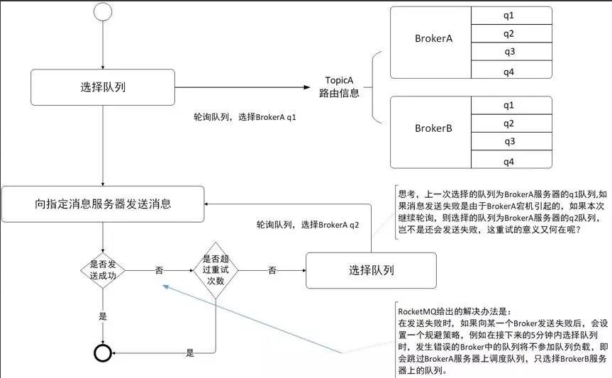

##1.2.2 消息发送高可用
在创建Topic的时候，把Topic的多个Message Queue创建在多个Broker组上（相同Broker名称，不同 brokerId的机器组成一个Broker组），
这样当一个Broker组的Master不可 用后，其他组的Master仍然可用，Producer仍然可以发送消息。
 RocketMQ目前还不支持把Slave自动转成Master，如果机器资源不足， 
 需要把Slave转成Master，则要手动停止Slave角色的Broker，更改配置文 件，用新的配置文件启动Broker
